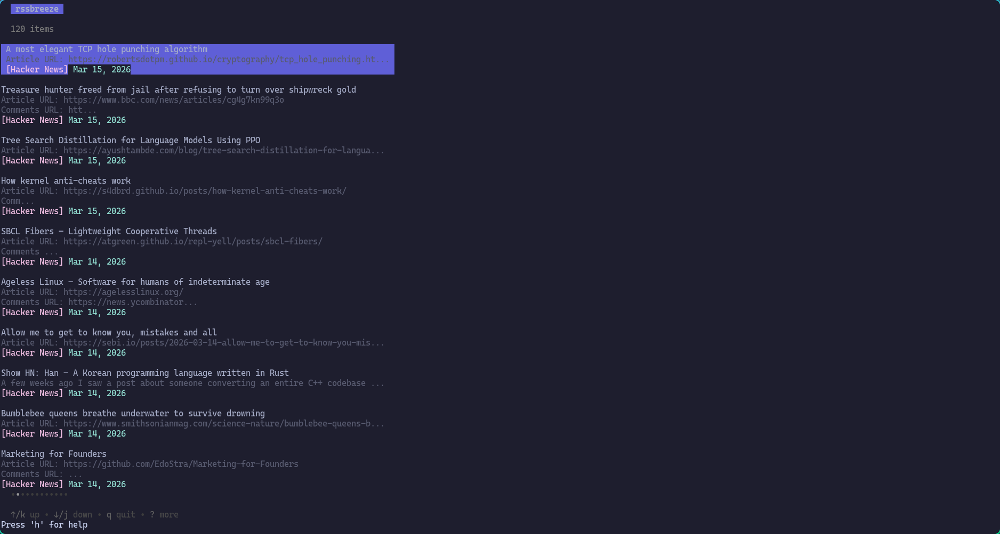

# rssbreeze
An RSS reader that doesn't blow.



rssbreeze is a TUI for reading RSS feeds without leaving your terminal. Add any number of RSS feeds, browse headlines at a glance, open articles in your browser with a single keypress, bookmark items, and filter by feed or date range. rssbreeze tracks which articles you've already read so new items are always clearly marked.

Built with Go and the [Bubble Tea](https://github.com/charmbracelet/bubbletea) framework. A fork of my previous project, [awsbreeze](https://github.com/grammeaway/awsbreeze), an AWS news reader that I built for myself, but I figured the core functionality could be useful to more people if it supported arbitrary RSS feeds.

## Installation

### With Go
```bash
go install github.com/grammeaway/rssbreeze/v2@latest
```

This installs the `rssbreeze` binary to `$GOPATH/bin`. Make sure that directory is on your `PATH`.

### Pre-built binaries
Download the release for your OS from the [releases page](https://github.com/grammeaway/rssbreeze/releases), unzip, and move the binary somewhere on your `PATH` (e.g. `/usr/local/bin` on Linux/macOS).

### Nightly build
```bash
go install github.com/grammeaway/rssbreeze/v2@main
```

## Verify installation
```bash
rssbreeze version
```

## Usage

On first launch, rssbreeze has no feeds configured. Press `a` to add your first RSS feed — you'll be prompted for a name and a URL. After that, rssbreeze fetches all configured feeds on startup and every time you press `r`.

### Controls

| Key | Action |
|-----|--------|
| `↑`/`↓` or `j`/`k` | Navigate items |
| `Enter` | Open selected item in browser |
| `b` | Toggle bookmark on selected item |
| `B` | Toggle bookmarks-only filter |
| `r` | Refresh all feeds |
| `f` | Filter by date (enter number of days) |
| `F` | Cycle through feed filter |
| `a` | Add a new RSS feed |
| `D` | Delete the feed active in the current feed filter |
| `c` | Clear all filters |
| `n` | Mark all items as seen |
| `h` | Toggle help |
| `q` | Quit |

`●` Green dots mark unread items. `★` Yellow stars mark bookmarked items.

## Config and cache files

rssbreeze stores its data in the OS cache directory under `rssbreeze/`:

| File | Contents |
|------|----------|
| `seen.json` | GUIDs of articles you've opened (used to track "new" status) |
| `bookmarks.json` | Your bookmarked articles |
| `feeds.json` | Your configured RSS feeds |

On Linux this is typically `~/.cache/rssbreeze/`, on macOS `~/Library/Caches/rssbreeze/`, and on Windows `%LocalAppData%\rssbreeze\`.

## Contributing
Issues and pull requests are welcome, just make a fork and open a PR.

---

## Acknowledgements

rssbreeze is a generalized fork of [awsbreeze](https://github.com/grammeaway/awsbreeze), an AWS-specific news reader TUI built by me, in response to some UI/UX changes on the AWS "What's New" page, that I didn't personally care that much for. The original codebase was refactored into rssbreeze with the assistance of Claude Code, which handled the multi-feed architecture, and feed management UI.
