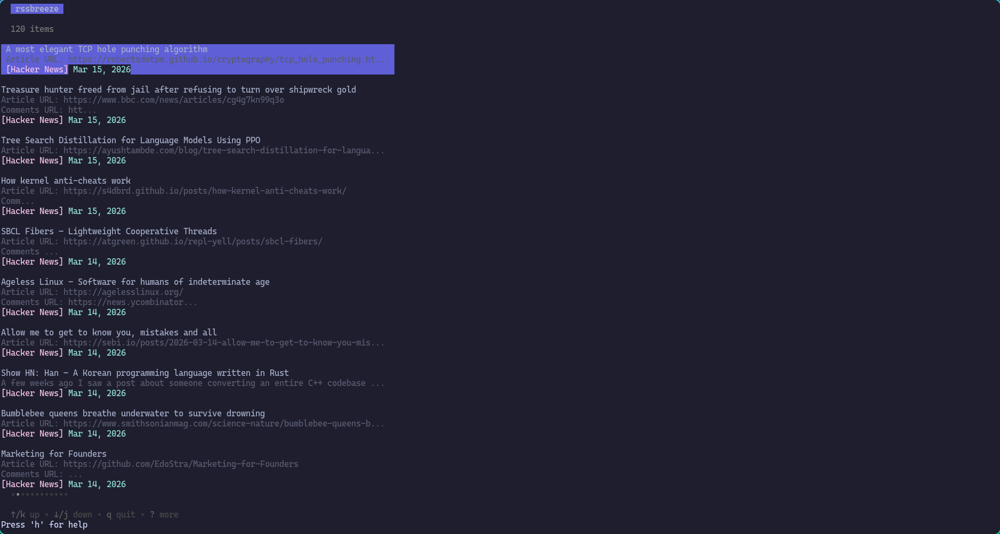

# rssbreeze
An RSS reader that doesn't blow.



rssbreeze is a TUI for reading RSS feeds without leaving your terminal. Add any number of RSS feeds, browse headlines at a glance, open articles in your browser with a single keypress, bookmark items, and filter by feed or date range. rssbreeze tracks which articles you've already read so new items are always clearly marked.

Built with Go and the [Bubble Tea](https://github.com/charmbracelet/bubbletea) framework. A fork of my previous project, [awsbreeze](https://github.com/grammeaway/awsbreeze), an AWS news reader that I built for myself, but I figured the core functionality could be useful to more people if it supported arbitrary RSS feeds.

## Installation

### With Go
```bash
go install github.com/grammeaway/rssbreeze/v2@latest
```

This installs the `rssbreeze` binary to `$GOPATH/bin`. Make sure that directory is on your `PATH`.

### Pre-built binaries
Download the release for your OS from the [releases page](https://github.com/grammeaway/rssbreeze/releases), unzip, and move the binary somewhere on your `PATH` (e.g. `/usr/local/bin` on Linux/macOS).

### Nightly build
```bash
go install github.com/grammeaway/rssbreeze/v2@main
```

## Verify installation
```bash
rssbreeze version
```

## Usage

rssbreeze opens on the **feed overview**. It lists an "All feeds" entry followed by each configured feed, with its load status, item count and number of new items. Nothing is fetched at startup. A feed is only downloaded when you open it, and opening "All feeds" downloads every feed that isn't loaded yet. Results show up as each feed arrives.

On first launch there are no feeds. Press `a` to add one, and you'll be prompted for a name and a URL. Feed names must be unique.

"All feeds" shows the newest 50 items across all loaded feeds (configurable with `page_size`, see below). Moving to the last item loads the next page.

Both RSS and Atom feeds are supported.

### Controls

**Overview**

| Key | Action |
|-----|--------|
| `↑`/`↓` or `j`/`k` | Navigate feeds |
| `Enter` | Open the selected feed (or All feeds) |
| `a` | Add a new RSS feed |
| `e` | Edit the selected feed's name and URL |
| `D` | Delete the selected feed (asks for confirmation) |
| `r` | Refresh the selected feed (or all feeds) |
| `h` | Toggle help |
| `q` / `esc` | Quit |

**Feed items**

| Key | Action |
|-----|--------|
| `↑`/`↓` or `j`/`k` | Navigate items |
| `Enter` | Open selected item in browser |
| `b` | Toggle bookmark on selected item |
| `B` | Toggle bookmarks-only filter |
| `f` | Filter by date (enter number of days) |
| `c` | Clear all filters |
| `n` | Mark all items matching the filters as seen |
| `r` | Refresh the feed(s) in view |
| `tab` / `shift+tab` | Switch to the next / previous feed (All feeds included), in overview order |
| `esc` | Back to the overview |
| `h` | Toggle help |
| `q` | Quit |

`●` Green dots mark unread items. `★` Yellow stars mark bookmarked items.

### Sharing feeds

```bash
rssbreeze export feeds.json      # or no file argument, to print to stdout
rssbreeze import feeds.json      # or `-` to read from stdin
```

`export` writes your feed list and settings. Bookmarks and read state are not included. `import` merges the feeds into your own list:
- a feed whose URL you already have is skipped
- a feed whose name you already use for a different URL is skipped, with a warning
- your own settings are left untouched

Importing the same file twice is harmless.

## Config and cache files

rssbreeze stores its data in the OS cache directory under `rssbreeze/`:

| File | Contents |
|------|----------|
| `seen.json` | GUIDs of articles you've opened (used to track "new" status) |
| `bookmarks.json` | Your bookmarked articles |
| `feeds.json` | Your configured RSS feeds, plus optional settings |

On Linux this is typically `~/.cache/rssbreeze/`, on macOS `~/Library/Caches/rssbreeze/`, and on Windows `%LocalAppData%\rssbreeze\`.

Settings in `feeds.json`:

| Key | Default | Meaning |
|-----|---------|---------|
| `page_size` | `50` | Items per page in the All feeds view |

## Contributing
Issues and pull requests are welcome, just make a fork and open a PR.

---

## Acknowledgements

rssbreeze is a generalized fork of [awsbreeze](https://github.com/grammeaway/awsbreeze), an AWS-specific news reader TUI built by me, in response to some UI/UX changes on the AWS "What's New" page, that I didn't personally care that much for. The original codebase was refactored into rssbreeze with the assistance of Claude Code, which handled the multi-feed architecture, and feed management UI.
